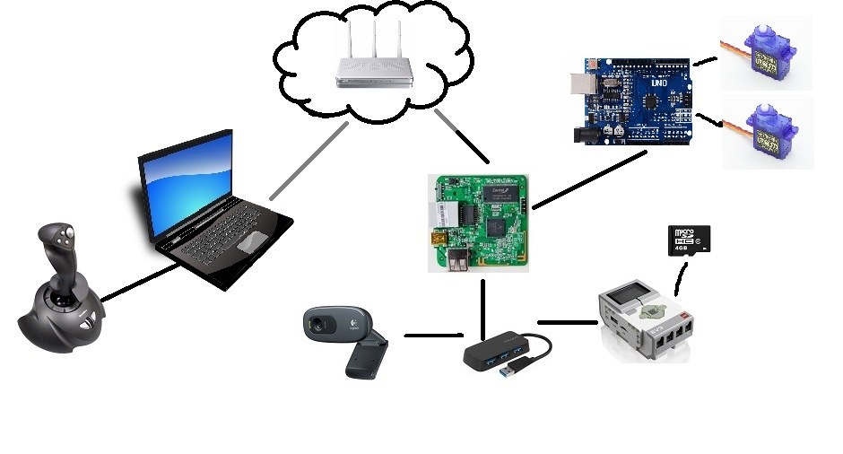

# legowrt
This project was made for my son, who asked me to make possible wireless control his Lego Mindstorm EV3 robot from PC.
Below is the log of what was done, what is needed to be done and several notes and instructions.



## Requirements from my boy :octocat:
* Robot shall has a camera eye and image shall be visible on laptop
* Robot shall be controlled via joystick connected to laptop
* Notebook and robot shall communicate wirelessly (e.g via wifi)

## Hardware we will work with
* WiFi router and PC or laptop (my with CentOS 7)
* [Lego Mindstorms](https://www.lego.com/mindstorms/)
* Micro SDHC card with [ev3dev image](http://www.ev3dev.org/docs/getting-started/)
* [TP-Link TL-MR3020 router with OpenWRT onboard](https://wiki.openwrt.org/toh/tp-link/tl-mr3020)
* OpenWrt supported webcam, e.g [Logitech HD Webcam C270](http://www.logitech.com/en-us/product/hd-webcam-c270)
* Joystick 
* USB hub
* USB-miniUSB cord

## Plan and progress and thoughts
- [x] Setup OpenWRT to [TP-Link TL-MR3020](https://wiki.openwrt.org/toh/tp-link/tl-mr3020)
- [x] Setup [ev3dev](http://www.ev3dev.org/docs/getting-started/) for Lego EV3 Brick
- [ ] ~Connect Lego EV3 Brick to wifi network~ **Note:** this requires WiFi dongle and will occupy single USB port
- [x] Connect MR3020 board to EV3 Brick with [USB reverse tethering](#USB-reverse-tethering)
- [x] Setup [port forwarding from MR3020 to EV3](#Port-forwarding-from-MR3020-to-EV3) Brick
- [x] Run python listening server on EV3 Brick and teset connection from laptop 
- [ ] Make same test with WebCamera and EV3 Brick connected to MR3020 board via USB hab
- [ ] Connect joystick to laptop
- [ ] Find out a way to code joystick (may by pygame?)
- [ ] Develop python3 listenening server for EV3 Brick
- [ ] Code client side application [check this](http://stackoverflow.com/questions/27676637/stream-video-in-python-use-pygame-lib)
- [ ] Add auto configuration usb0 interface on MR3020 board [configure DHCP?](http://en.qi-hardware.com/wiki/Ethernet_over_USB#Editing-the-Host's-Network-Configuration)

## Configuration notes
### USB reverse tethering
This simply requires additional package to install on MR3020 board
```shell
> opkg update
> opkg install kmod-usb-net-cdc-ether
> reboot
```
More reading about [OpenWRT usb reverse tethering](https://wiki.openwrt.org/doc/howto/usb.reverse.tethering)

EV3 brick part is described [here](http://www.ev3dev.org/docs/tutorials/connecting-to-the-internet-via-usb/)


### Port forwarding from MR3020 to EV3
Port forwarding is described in ```/etc/config/rinetd``` 

**TODO:** add example here

Restart **rinetd**
```
> /etc/init.d/rinetd restart
```


