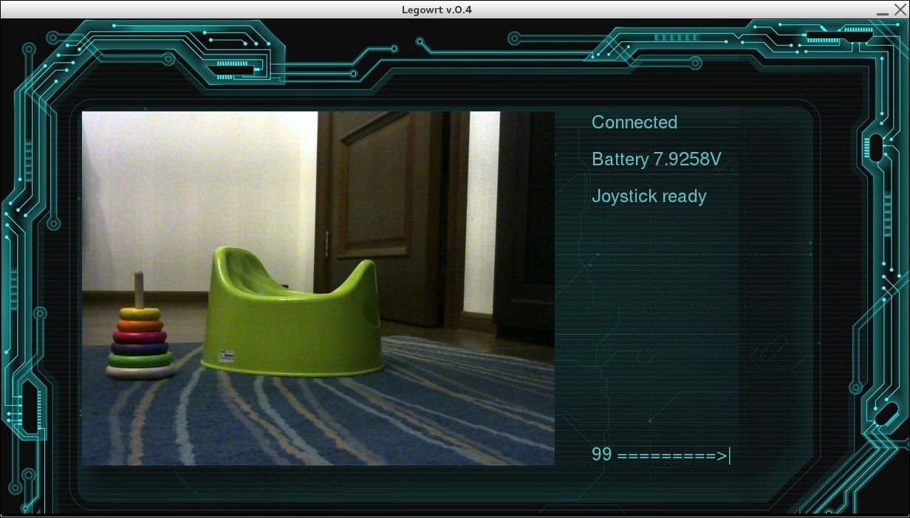
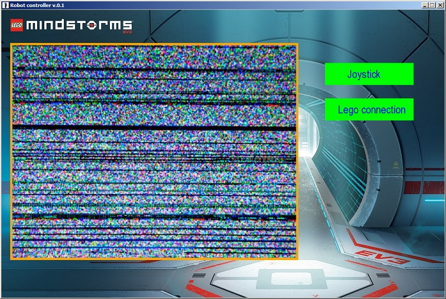

# EV3 Client
Client to connect to Lego Mindstorms EV3 and control it using joystick.

## Requires
 * Python3
 * [pygame](http://pygame.org) module
 
## TODO:
 - [ ] Client stops too long and bugy
 - [ ] Add control with keyboard arrows

## ver 0.4

## ver 0.1

